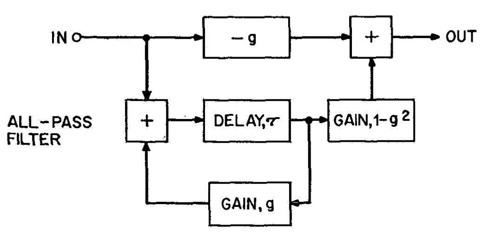
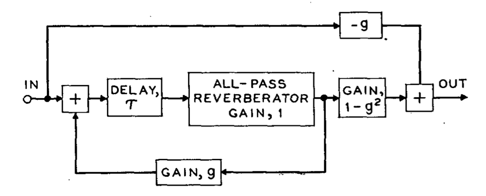

# A simple FDN reverb

This is an FDN reverb based on a design by *Manfred R. Schroeder* in his 1962 paper, *Natural Sounding Artifical Reverberation*.


## Design

The algorithm consists of a 6 delay lines in series, feeding into 15 series allpass delays each, with allpass feedforward/feedback around every delay line.

1. An all-pass delay.



2. A delay line containing a section of nested all-pass delays.


___

To build using CMake, run the following in the repo directory:
```
$ cmake -S ./Source -B build
$ cmake --build build
```

You can download CMake from [here](https://cmake.org/download/)
